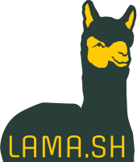

# Getting started
```
curl lama.sh | sh
```

# Introduction


lama is a simple HTTP server that serves files, directories and verbosely logs requests.
This project has two main qualities:
1. **Easy to use:** lama allows one to start a web server on any Linux/MacOSX using 25 characters, with no requirements (not even libc).
2. **Trustworthy:** lama's code and download script are as simple as they can be, thus can be inspected and verified. We have a very shallow
   dependency tree (just two dependencies other than the Go standard library).

## Configuration
`server` sports a few command-line flags which configure its behaviour. To pass those flags use
```
$ curl lama.sh | sh -s -- <flags>
```
For example to print the list of available flags
```
$ curl lama.sh | sh -s -- --help
Usage of lama:
  -d, --directory string   the directory to serve (default ".")
  -N, --dont-dump          be less verbose and don't dump requests
  -D, --dont-serve         don't serve any directy (ignores --directory)
  -l, --localhost          serve on localhost only
  -p, --port string        port to serve on (default "8080")
  -v, --version            prints the version
```

# How to contribute
All contributions/PR/issue/beer are welcome ❤️.

It's easiest to develop _lama_ using Gitpod, a free one-click online IDE (who I happen to be working on):

[](https://gitpod.io#github.com/32leaves/lama)
